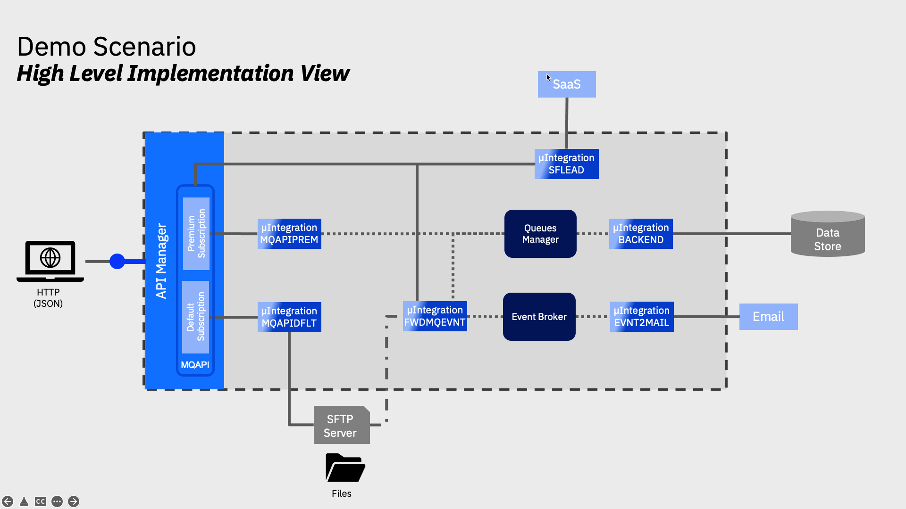

<FeatureCard
  title="Agile Integration Best Practices Using an IBM GitOps Automation Framework"
  color="dark"
  >


</FeatureCard>

<AnchorLinks>
  <AnchorLink>Lab Overview</AnchorLink>
  <AnchorLink>Prerequisites</AnchorLink>
  <AnchorLink>Business Context</AnchorLink>
  <AnchorLink>Automation Framework Introduction</AnchorLink>
  <AnchorLink>Lab Environment</AnchorLink>
  <AnchorLink>1 - Clone Repositories</AnchorLink>
  <AnchorLink>2 - Explore the Environment</AnchorLink>
  <AnchorLink>3 - Prepare the Subscription</AnchorLink>
  <AnchorLink>4 - Deploy ACE and ES instances</AnchorLink>
  <AnchorLink>5 - Activate MQ Queue Manager</AnchorLink>
  <AnchorLink>6 - Customize Event Streams</AnchorLink>
  <AnchorLink>7 - Configure ACE</AnchorLink>
  <AnchorLink>8 - Customize APIC</AnchorLink>
  <AnchorLink>9 - Check the Demo Assets</AnchorLink>
  <AnchorLink>Summary</AnchorLink>
</AnchorLinks>

***

## Lab Overview

Have you received requests to deliver a Multi-style Integration demo or PoC, and you don’t know how to quickly prepare this environment? You are on the right place. In this session,  you will learn how to prepare a demo/PoC environment using GitOps automation framework. This environment will include different assets, capabilities, services and applications of IBM Cloud Pak for Integration.

The first main goal of this session is to provide you a complete CP4I environment with multiple demo assets to be ready to progress your sales opportunity. This first goal is achieved by reusing a <a href="" target="_blank">multi-style integratio demo assets</a>.

The second goal is to provide this environment quickly and easily, by using the GitOps automation framework, more details <a href="https://production-gitops.dev/" target="_blank">here</a> about Cloud Pak Production Deployment Guides.

This document was created for Senior Technical Specialists, and we know you are one of them. Because of that, instead to have very detailled steps, we have high level directions about what you need to do. There are some challenges that we don't explain how to do them, but we are pretty sure that you can do it! But let the proctors know if you have any issue to complete the challenges.

As part of the evalution process of this session, at the end, you will need to capture and upload screenshots of your final progress. In this document, you will see some references about the necessary screenshots.

In this session you will learn to:
  - understand an IBM opinionated point of view regarding a GitOps centric method to manage RHOCP infrastructure, IBM integration software and application workload code (three tier GitOps architecture).
  - Review, develop, and extend an IBM GitOps automation repository that incapsulate key software components within the IBM Integration portfolio.
  - Position a GitOps automation framework as a key boot-strapping and operational mechanism supporting a Client PoC activity and Client adoption.

***

## Prerequisites

- You need to have an OpenShift environment with GitOps operators. For this session, your proctor will provide you a pre-installed environment, with admin access (more details below). If you want to create your personal environment, check this <a href="https://www.youtube.com/watch?v=SmDE80vuP3w" target="_blank">video</a> or follow the preparation section from this <a href="https://github.com/sko-master/multi-tenancy-gitops/blob/master/doc/sko-scenario.md" target="_blank">documentation</a>.
- You need to have installed in your machine:
  - <a href="https://docs.openshift.com/container-platform/4.8/cli_reference/openshift_cli/getting-started-cli.html" target="_blank">oc CLI</a> v4.6+.
  - github CLI
  - Bash Shell
  - JAVA v8+
  - <a href="https://stedolan.github.io/jq/" target="_blank">jq CLI</a>
- You need to have a SalesForce account. This should have been completed as part of the <a href="https://ibm-garage-tsa.github.io/cp4i-demohub/salesdemos/carrepair-new/prepare/#setting-up-salesforce" target="_blank">Tech Academy pre-requisite work</a>.
- You need to have a mailtrap account. This too should have been completed as part of the <a href="https://mailtrap.io/" target="_blank">Tech Academy pre-requisite work</a>.
- You have access to GitHub Organization with all repositories. Your proctor will provide that for you.

***

## Business Context

This document describes multiple use cases that highlight the multi-style integration patterns needed by an Integration Specialist to implement a digital transformation initiative that showcase the value Cloud Pak for Integration can provide.

In this case a customer has a system of record that has used for many years which ws designed to work with MQ to process requirements, and now they want to extend the application to expose an API in a asecure way as part of their mobile app.

But the requirement doesn't end there, they are also implementing a new CRM system as a Service and they want to keep both systems in sync without having to modify the original system of record.

Additionally as part of their digital transformation initiative they want to stay closer to their clients and they want to send email notifications when the client is taking certain actions in their mobile app. To support this strategy, the enterprise architecture team wants to implement an event backbone, as part of their event driven architecture.

The following diagram provides a high level view of the scenario:
  

In order to implement this demo you will need to deploy an instance of each one of the following components in your OCP Cluster:
  - API Connect Cluster
  - Event Streams Cluster
  - Queue Manager
  - App Connect Enterprise Integration Servers

The following diagram provides a high level implementation view of the scenario with the core capabilities:
  

To demonstrate the added value capabilities provided by CP4I you will deploy an instance of the following components in your OCP Cluster:
  - Platform UI (formerly known as Platform Navigator)
  - Automation Foundation Assets (formerly known as Asset Repository)
  - Operations Dashboard

***

## Automation Framework Introduction

### What are the Production Deployment Guides?

The <a href="https://production-gitops.dev/" target="_blank">Cloud Pak Production Deployment Guides</a> document and demonstrate how to design, deploy and operate cloud-native solutions leveraging IBM Cloud Pak capabilities in Red Hat OpenShift environments. The guides focus on Production level qualities of services such as High Availability, Security and Performance including how to design, install and manage your Cluster in the popular managed and unmanaged Cloud environments as well as tackling disconnected or air-gapped environments.


### Production Deployment Guide objectives

There are a number of objectives behind providing the Production Deployment Guides. The three main goals of the Guides are provided below:
  - Provide opinionated, validated Production topologies
  - Provide a GitOps driven automation framework
  - Enable IBMers to setup Production topologies


### What is GitOps?

GitOps requires us to describe the entire system declaratively in Git where the desired system state is versioned, managed and applied by software agents.

Automation is key for scale in the Cloud world and OpenShift and Cloud Paks are no different. The implementation code and artifacts provided along with these guides are based on a GitOps approach where infrastructure and everything deployed in to an OpenShift Cluster (including Cloud Paks) is described as code and is managed in the same way that application code would be.

More information on the gitops structure can be read in this <a href="https://production-gitops.dev/gitops/structure/" target="_blank">page</a>.

***

## Lab Environment

For this session you will use a ROKS 4.8 environment with 5 nodes (b3c.16x64). Following this video, you can have a personal environment for you, including GitOps operator and configuration. But for this section, your lab proctors pre-installed this cluster for you. They already installed GitOps, created an empty GitHub Organization and forked the automation repositories that you will use, for this empty organization (check the video to see the steps already completed).

Because of time restrictions, the proctors already installed some core services of Cloud Pak for Integration, avoiding you to wait almost 90 minutes to complete this installation. In the previous sections, you will check what are installed in this environment. Enjoy your lab!

***

## 1 - Clone Repositories

1. As explained before, you already have Github repositories for your team. On the left navigator menu, check the name of your cluster and GitHub organization. As soon as you have the name, let's clone the repositories in your local machine. Use the command below to define your GIT_ORG variable.

```
export GIT_ORG={REPLACE_WITH_YOUR_GIT_ORG}
```

2. Now let's clone the repositories to your local machine.
```
mkdir ${GIT_ORG}
cd ${GIT_ORG}
git clone https://github.com/${GIT_ORG}/multi-tenancy-gitops
git clone https://github.com/${GIT_ORG}/multi-tenancy-gitops-infra
git clone https://github.com/${GIT_ORG}/multi-tenancy-gitops-services
git clone https://github.com/${GIT_ORG}/multi-tenancy-gitops-apps
```

3. You are welcome to explore all the four repositories of the GitOps Automation framework.


***

## 2 - Explore the Environment

Now that you have all the repositories locally, let's check what have been deployed.

1. Let's start by exploring the GitOps Automation Framework YAML files. First, let's check the kustomization.yaml in infra layer (/multi-tenancy-gitops/0-bootstrap/single-cluster/1-infra/).

   `Challenge 2.1:` what namespaces are enabled? openshift console - check namespaces (tools ibm-common-services)

2. Let's explore the kustomization.yaml in services layer (/multi-tenancy-gitops/0-bootstrap/single-cluster/2-services/)

   `Challenge 2.2:` what are the instances enabled? How can you check Platform navigator and API Connect?

3. Let's check the installed operators in your Cluster Web Console (there is a URL available in the Team Environments page).

   `Challenge 2.3:` how do I see the Installed Operators in OpenShift web console?

4. Now, let's open the ArgoCD UI. Don't forget to find the ArgoCD URL and admin's password. *Tip:* ArgoCD is installed in the openshift-gitops namespace, just look for openshift-gitops-cntk in Secrets and in Routes.

   `Challenge 2.4:` Where do I see the ArgoCD URL? Where do I get the ArgoCD admin password?

5. In ArgoCD UI check all applications available. Check the application's healthy status.

6. Let's open the Platform navigator. *Tip:* All CP4I services are installed in the tools namespace.

   `Challenge 2.5:` Where do I see the Platform navigator URL? How do I get the CP4i admin's password?

7. Check the Integration's Instances available.

   `Challenge 2.6:` What are the instances available?

***

## 3 - Prepare the Subscription

Now it's your time to do some actions using the GitOps Automation Framework. Let's start by preparing some subscriptions.

1. Edit **multi-tenancy-gitops/0-bootstrap/single-cluster/2-services/kustomization.yaml**.

2. Uncomment the lines below.
```
- argocd/operators/ibm-ace-operator.yaml
- argocd/operators/ibm-eventstreams-operator.yaml
- argocd/operators/ibm-mq-operator.yaml
```

3. In the multi-tenancy-gitops folder: Add, Commit and Push the changes to multi-tenancy-gitops repository.
```
git add .
git commit -m "adding new operators"
git push origin
```

4. Back to the argoCD console, refresh the **02-Services** application. Maybe you need to wait few minutes to make sure that all the status are Sync and Healthy, before progressing.

   `Challenge 3.1:` What are the new applications available in ArgoCD?

5. Back to the OpenShift Web console, check if there are new operators available.

    `Challenge 3.2:` What are the new operators? How to check them?

***

## 4 - Deploy ACE and ES instances

Now, let's create App Connect Enterprise and Event Streams instances using the GitOps Automation Framework.

1. Edit **multi-tenancy-gitops/0-bootstrap/single-cluster/2-services/kustomization.yaml**.

2. Uncomment the lines below.
```
- argocd/instances/es-demo.yaml
- argocd/instances/ace-infra.yaml
```

3. In the multi-tenancy-gitops folder: Add, Commit and Push the changes to multi-tenancy-gitops repository.
```
git add .
git commit -m "deploying ace and es"
git push origin
```

4. Back to the argoCD console, refresh the **02-Services** application. Maybe you need to wait few minutes to make sure that all the status are Sync and Healthy, before progressing.

   `Challenge 4.1:` What are the new applications available in ArgoCD?

5. Back to the OpenShift Web console, check if there are new operators available.

    `Challenge 4.2:` What are the new operators?

6. Back to CP4i Platform Navigator, check if the new instances are available and ready.

    `Challenge 4.3:` How to check if the instances are available in Platform Navigator?

***

## 5 - Activate MQ Queue Manager

Now, let's start the application layer. First we need to create the MQ Queue Manager.

1. Edit **multi-tenancy-gitops/0-bootstrap/single-cluster/3-apps/kustomization.yaml**.

2. Uncomment the line below.
```
- argocd/sko-sample/mqmgr.yaml

```

3. In the multi-tenancy-gitops folder: Add, Commit and Push the changes to multi-tenancy-gitops repository.
```
git add .
git commit -m "mq queue manager"
git push origin
```

4. Back to the argoCD console, refresh the **03-Application** application. Maybe you need to wait few minutes to make sure that all the status are Sync and Healthy, before progressing.

   `Challenge 5.1:` What are the new applications available in ArgoCD?

5. On the OpenShift Web Console page, check the **qmgr-demo** are running.

6. On the CP4i Platform Navigator page, check the Queue Managers.

   `Challenge 5.2:` How many Queue Managers are available? How do you check them?

***

## 6 - Customize Event Streams

Now, let's create the Event Streams resources for our Multi-Style demo.

1. Edit **multi-tenancy-gitops/0-bootstrap/single-cluster/3-apps/kustomization.yaml**.

2. Uncomment the line below.
```
- argocd/sko-sample/eventstream.yaml

```

3. In the multi-tenancy-gitops folder: Add, Commit and Push the changes to multi-tenancy-gitops repository.
```
git add .
git commit -m "customize ES"
git push origin
```

4. Back to the argoCD console, refresh the **03-Application** application. Maybe you need to wait few minutes to make sure that all the status are Sync and Healthy, before progressing.

5. Open the **eventstream** application and check the log of **es-demo-setup-job-???** pod.

6. You should see a failure that statefulsets.apps is forbidden. Let's fix it! Edit **multi-tenancy-gitops-apps/sko-sample/eventstream/es-demo-setup-job-sa-role.yaml**.

7. In the Rules section, create a new rule with the content below and save the new YAML file.
```
- apiGroups: ["apps"]
  resources: ["statefulsets"]
  verbs: ["get", "watch", "list"]
```

8. In the multi-tenancy-gitops-apps folder: Add, Commit and Push the changes to multi-tenancy-gitops-apps repository.
```
git add .
git commit -m "apps statefulsets permission"
git push origin
```

9. Back to the argoCD console, refresh the **eventstream** application. Maybe you need to wait few minutes to make sure that all the status are Sync and Healthy.

10. Now you need to delete **es-demo-setup-job** to re-run the pod.

11. Now let's check the log of **es-demo-setup-job-???** pod again.

12. Wow, another failure!! Now with route. Follow the same approach of the previous error, but now include a rule to resources **routes** in the apiGroups **route.openshift.io**.

13. Repeat steps 8 to 11, to deploy the changes.

***

## 7 - Configure ACE

Now, let's work with Application Connect Enterprise. In this part, you are configuring artifacts, secrets and certificates.

1. Open the **multi-tenancy-gitops-apps/sko-sample/ace-00-config** folder.

2. Execute the commands below to generate the configuration YAML files.
    - SF_USER is *Email addess used to log into Salesforce*
    - SF_PWD is *[Password used to log in][token received in email]*
    - SF_CLIENT_ID is *[Consumer Key]*
    - SF_CLIENT_SECRET is *[Consumer Secret]*
    - MAILTRAP_USER is *Mailtrap SMTP User*
    - MAILTRAP_PWD is *Mailtrap SMTP Password*

```
./06-ace-config-barauth-github.sh
./07-ace-config-policy-mq.sh
SF_USER=<my-sf-user> SF_PWD=<my-sf-pwd> SF_CLIENT_ID=<my-sf-client-id> SF_CLIENT_SECRET=<my-sf-client-secret> SF_LOGIN_URL="https://login.salesforce.com" ./08-ace-config-accounts-sf.sh
./10-ace-config-policy-es-scram.sh
./11-ace-config-setdbparms-es-scram.sh
./12-ace-config-truststore-es.sh
./13-ace-config-policy-udp.sh
./14-ace-config-policy-email.sh
MAILTRAP_USER=<user> MAILTRAP_PWD=<pwd> ./15-ace-config-setdbparms-email.sh
```

3. Verify that there are 9 YAML files generated in the *ace-00-config* folder.

4. Edit **multi-tenancy-gitops-apps/sko-sample/ace-00-config/kustomization.yaml** file.

5. Uncomment the lines below (all the content).
```
- ace-config-accounts-designer.yaml

- ace-config-policy-es-scram.yaml
- ace-config-setdbparms-es-scram.yaml
- ace-config-truststore.yaml

- ace-config-policy-udp.yaml
- ace-config-policy-email.yaml
- ace-config-setdbparms-email.yaml
```

6. In the multi-tenancy-gitops-apps folder: Add, Commit and Push the changes to multi-tenancy-gitops-apps repository.
```
git add .
git commit -m "ace config"
git push origin
```

7. Back to the argoCD console, refresh the **03-Application** application. Maybe you need to wait few minutes to make sure that all the status are Sync and Healthy, before progressing.

8. Back to Platform Navigator, open **App Connect Dashboard** (Run > Integration) and check the Integration servers.

***

## 8 - Customize APIC

***

## 9 - Check the Demo Assets

***

## Summary

You have successfully completed this lab. In this lab you learned how to:

 - Deploy a back-end integration to containers that are readily available as a scalable web service.
 - Secure access to the back-end integration by creating a secure, governed API using the OpenAPI definition of the integration.
 - Use Operations Dashboard to tracing  MQ, APIC and APPC

Now that you’ve made your back-end integrations ready for external distribution, your developer community is able to access the APIs via a developer portal. The developer portal is included in the platform and provides a full-featured experience to onboard and nurture your API consumers.  For more information about Cloud Pak for Integration, access [here](https://www.ibm.com/cloud/cloud-pak-for-integration).
